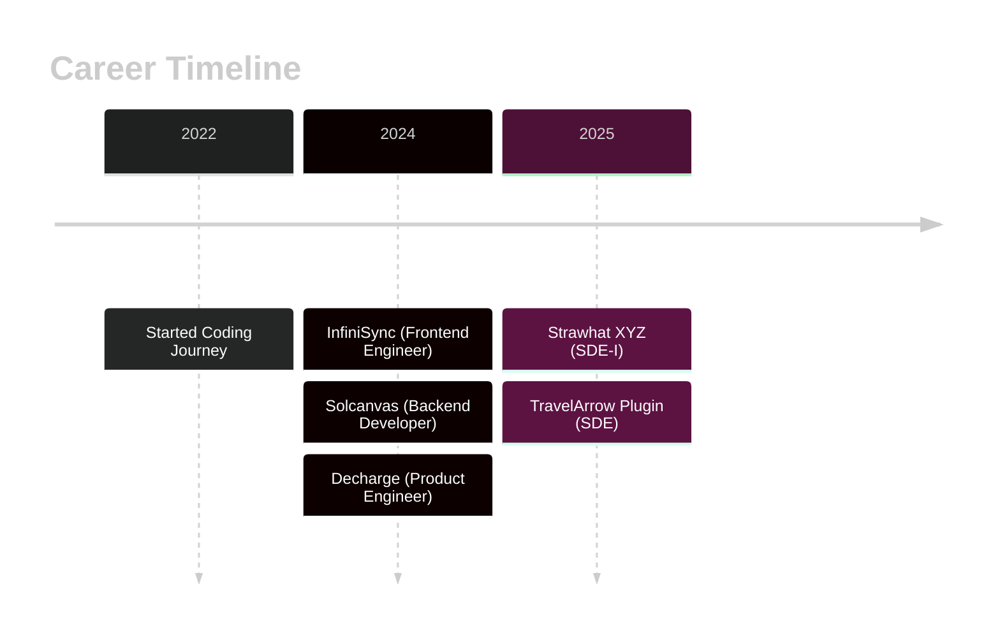

<div align="center">


</div>

<!-- Modern Badge Group -->
<p align="center">
  
  
  
</p>

<p align="center">
  <a href="https://www.adityaslyf.com"></a>
  <a href="https://linkedin.com/in/adityaslyf"></a>
  <a href="https://twitter.com/adityaslyf"></a>
  <a href="mailto:aditya.varshneymail@gmail.com"></a>
</p>


<br/>

## 🚀 About Me


```yaml
name: Aditya Varshney
located_in: Bangalore, India
current_role: Software Development Engineer
company: TravelArrow Plugin
education: B.Tech IT @ KIET (AKTU)

fields_of_interests:
  - Full-Stack Development
  - iOS App Development
  - Performance Optimization
  - System Design
  
technical_background:
  - Building scalable web & mobile apps
  - 2+ years of production experience
  - 30% performance improvements achieved
  - 5,000+ transactions processed
  
currently_learning: 
  - Advanced Swift & SwiftUI
  - Cloud Architecture (AWS)
  - Microservices Design
```

<br clear="right"/>


## 💻 Tech Stack

<div align="center">

### 🎨 Frontend & Mobile


### ⚙️ Backend & Database


### 🛠️ Languages & Tools


</div>


## 🎯 Featured Projects

<div align="center">

<table bordercolor="#66b2b2">
  
<tr>
<td width="50%" valign="top">

### 🔴 RedCircle
#### Full-Stack Content Platform

> Tokenizing Reddit posts with gamified engagement

**Stack:** React • TypeScript • Node.js • PostgreSQL

✨ **Key Features**
- 🎮 Gamification engine with performance metrics
- 🔐 OAuth 2.0 Reddit integration
- 👥 Creator-curator workflow system
- 📊 Real-time analytics dashboard

[View Project →](https://github.com/adityaslyf/RedCircle)

</td>

<td width="50%" valign="top">

### 🤖 ReviewIQ
#### AI-Powered PR Review Platform

> Smart GitHub code review automation

**Stack:** React • TypeScript • Docker • AI

✨ **Key Features**
- 🧠 Vector embeddings for context analysis
- ⚡ Automated GitHub webhook workflows
- 📈 Developer productivity insights
- 🔍 Intelligent code review suggestions

[View Project →](https://github.com/adityaslyf/ReviewIQ)

</td>
</tr>

</table>

</div>


## 💼 Professional Journey



<div align="center">

| 🏢 Company | 👨‍💻 Role | 🎯 Impact |
|:---:|:---:|:---|
| **TravelArrow Plugin** | SDE | Building scalable travel solutions |
| **Strawhat XYZ** | SDE-I | 30% performance boost, Chrome extension |
| **Decharge** | Product Engineer | 5K+ secure transactions processed |
| **InfiniSync** | Frontend Engineer | WebSocket real-time implementations |

</div>


## 🏆 Achievements & Highlights

<div align="center">

### 📊 Impact Metrics

<table>
<tr>
<td align="center" width="25%">

<br/><strong>30%+</strong>
<br/>Performance Boost
</td>
<td align="center" width="25%">

<br/><strong>5,000+</strong>
<br/>Transactions
</td>
<td align="center" width="25%">

<br/><strong>10+</strong>
<br/>Production Apps
</td>
<td align="center" width="25%">

<br/><strong>2+ Years</strong>
<br/>Experience
</td>
</tr>
</table>

</div>


## 🐍 Contribution Snake

<div align="center">

<picture>
  <source media="(prefers-color-scheme: dark)" srcset="https://raw.githubusercontent.com/adityaslyf/adityaslyf/output/github-contribution-grid-snake-dark.svg">
  <source media="(prefers-color-scheme: light)" srcset="https://raw.githubusercontent.com/adityaslyf/adityaslyf/output/github-contribution-grid-snake.svg">
  
</picture>

</div>


## 💭 Random Dev Wisdom

<div align="center">


</div>


## 📬 Let's Connect!

<div align="center">


<br/>

### 🌐 Find me around the web

[](https://www.adityaslyf.com)

[](https://linkedin.com/in/adityaslyf)
[](https://twitter.com/adityaslyf)

📧 **Email:** aditya.varshneymail@gmail.com

<br/>

### ☕ Support My Work

If my code made your day better, consider buying me a coffee!

<a href="https://www.buymeacoffee.com/adityaslyf">
  
</a>

</div>


<div align="center">

### 🌟 Thanks for visiting!


⭐ **Star some repositories if you find them interesting!**

<br/>


</div>
